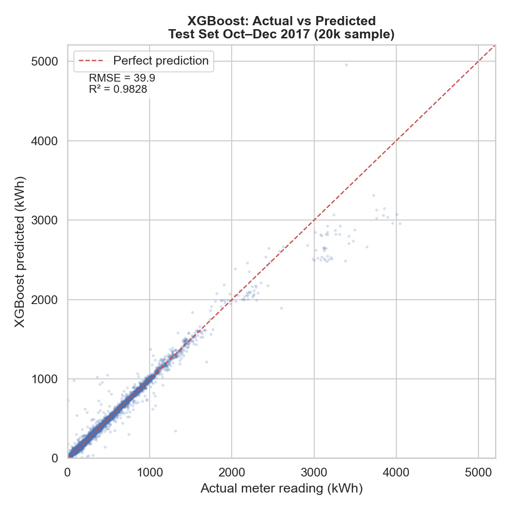
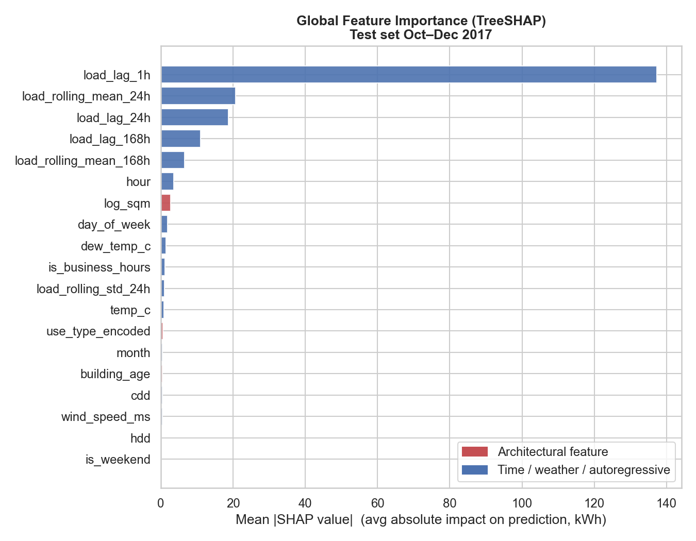
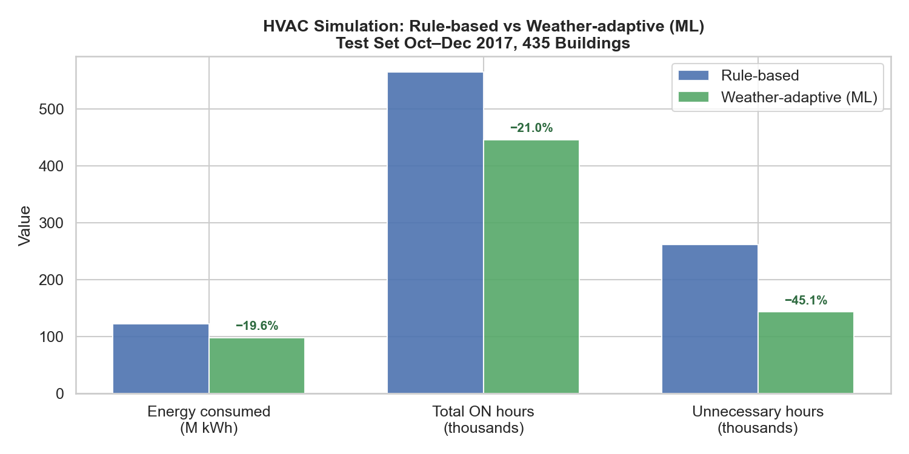

# Building Energy Forecasting & HVAC Control Simulation

Hourly electricity-load forecasting for **435 commercial buildings** (7.6M rows,
2016–2017), a **rule-based vs. weather-adaptive HVAC control** simulation built on top of
the forecasts, and a **SHAP-based analysis of which building characteristics make a
building hard to forecast**. Data: [Building Data Genome Project 2](https://github.com/buds-lab/building-data-genome-project-2).



*XGBoost on a 20k-row test sample; the metrics annotated in the figure are for that sample — full-test-set numbers are in the table below.*

## Architecture

The project is three stacked layers, each a standalone script with MLflow tracking:

1. **Load prediction** — `src/models/`
   Linear Regression, Random Forest and XGBoost on lag/rolling/weather/building features
   (1-step ahead), plus a PyTorch LSTM for 24-step multi-horizon forecasting.
2. **Control-policy simulation** — `src/simulation/hvac_sim.py`
   Two HVAC scheduling policies replayed over every building-hour: a fixed-schedule
   rule-based baseline vs. a weather-adaptive policy that gates pre/post-occupancy
   conditioning on heating/cooling degree-days. Both guarantee zero comfort violations
   by construction, so the energy delta isolates the scheduling logic.
3. **Architectural error analysis** — `src/analysis/shap_analysis.py`
   TreeSHAP attribution (XGBoost native `pred_contribs`, no `shap` dependency) plus
   per-building error correlated against size, age and use type.

## Results

Test set: Oct–Dec 2017, held out and touched once. Time-based split, never random.

| Model             | RMSE   | MAE   | R²     | MAPE   | Task                  |
|-------------------|--------|-------|--------|--------|-----------------------|
| Linear Regression | 85.41  | 19.21 | 0.9274 | —      | 1-step ahead          |
| Random Forest     | 67.05  | 7.88  | 0.9552 | —      | 1-step ahead          |
| XGBoost           | 70.38  | 9.90  | 0.9507 | 7.18%  | 1-step ahead          |
| LSTM              | 101.35 | 20.20 | —      | 12.45% | 24-step ahead (multi) |

### Key findings

- **The model is ~autoregressive.** `load_lag_1h` dominates attribution; architectural
  features (size, age, use type) account for only **1.7 %** of total SHAP mass. Explicit
  degree-days add almost nothing once recent-load lags are present.
- **Smaller buildings are harder to forecast.** Building size vs. relative error
  (CV(RMSE)) has Spearman ρ = **−0.23** (p = 1.6e-6). A large meter sums many independent
  zones, so idiosyncratic swings average into a smooth, highly autocorrelated curve;
  a small building is driven by a few discrete events and is spikier hour-to-hour.
- **Offices are modestly harder than Education buildings** (median MAPE 6.6 % vs 5.3 %).
  Academic schedules are rigidly periodic and the 24 h / 168 h lags capture that; offices
  carry more aperiodic plug-load and variable occupancy.
- **Building age: no significant effect** (ρ = +0.09, p = 0.33) — reported as a null.
  `yearbuilt` is missing for 70 % of buildings and ignores retrofits.

The practical takeaway: architectural features barely move the point forecast, but they
predict *which* buildings the model will struggle on — useful for setting control margins.

<p align="center">
  
  
</p>

More figures in [`reports/figures/`](reports/figures/).

## Engineering notes

- **Leakage-safe evaluation** — strict chronological train / val / test split; XGBoost
  early-stopping uses the val slice only.
- **Memory-optimised pipeline** — category dtypes and in-place transforms cut peak RAM by
  ~50 % in both the merge and feature-building steps on the 7.6M-row frame.
- **Experiment tracking** — every training and analysis run logs params, metrics, model
  artifacts and figures to a local MLflow store.
- **Code quality** — type hints on all signatures, `ruff`-clean, no hardcoded paths
  (`Path` + `.env`), Parquet for all intermediate data, conventional commits.

## Setup

```bash
git clone https://github.com/grigorybaluev/building_energy_project.git
cd building_energy_project
poetry install
cp .env.example .env
```

Download the BDG2 dataset (`electricity_cleaned.csv`, `weather.csv`, `metadata.csv`) from
[Kaggle](https://www.kaggle.com/datasets/claytonmiller/buildingdatagenomeproject2) into
`data/raw/`. The LSTM script additionally needs PyTorch: `poetry run pip install torch`.

## Run

Scripts are run in order; each reads the previous step's Parquet output.

```bash
poetry run python src/data/ingest_bdg2.py         # filter buildings, long format
poetry run python src/data/ingest_weather.py      # site-matched weather
poetry run python src/data/merge.py               # join + time / degree-day features
poetry run python src/features/build_features.py  # lags, rolling stats, metadata encoding
poetry run python src/models/train_baseline.py    # LR / RF / XGBoost → MLflow
poetry run python src/models/train_lstm.py        # 24-step LSTM → MLflow
poetry run python src/simulation/hvac_sim.py      # control-policy simulation
poetry run python src/analysis/shap_analysis.py   # SHAP + architectural error analysis
poetry run python src/visualization/plot_results.py

poetry run mlflow ui                              # browse runs at http://localhost:5000
poetry run ruff check .
```

## Project structure

```
src/
├── data/            ingest_bdg2.py · ingest_weather.py · merge.py
├── features/        build_features.py
├── models/          train_baseline.py · train_lstm.py
├── simulation/      hvac_sim.py
├── analysis/        shap_analysis.py
└── visualization/   plot_results.py
notebooks/           01_eda.ipynb — exploratory analysis only
reports/figures/     generated PNGs
data/                raw/ and processed/ (gitignored)
```

## Roadmap

- [ ] `pytest` suite for the data pipeline and simulation
- [ ] GitHub Actions — ruff + pytest on every push
- [ ] Dockerfile for the training pipeline
- [ ] FastAPI `/predict` endpoint serving the XGBoost model
- [ ] Streamlit dashboard

Progress is tracked in [Issues](https://github.com/grigorybaluev/building_energy_project/issues).

## License

[MIT](LICENSE)
